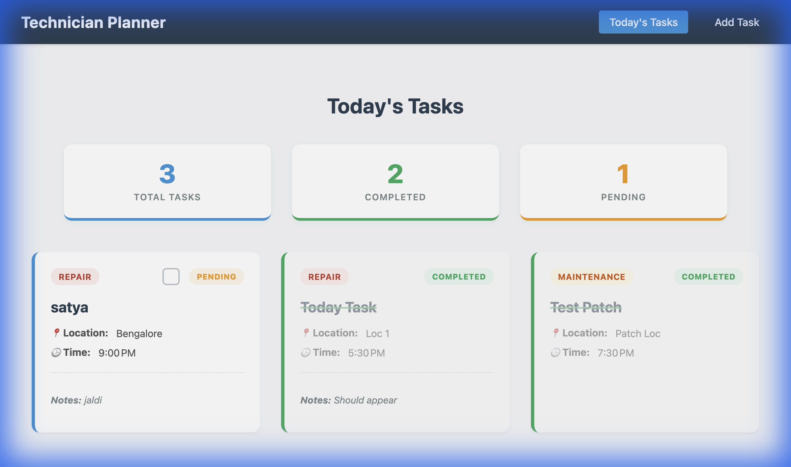
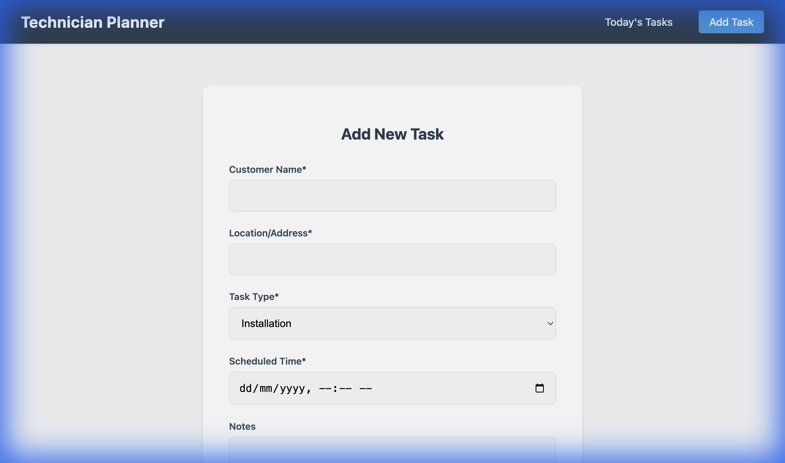

# Technician Daily Planner

A full-stack web application for technicians to manage their daily schedule, track tasks, and log completions efficiently. Built with the MEAN stack (MongoDB, Express, Angular, Node.js).

## 🚀 Tech Stack
- **Frontend**: Angular 19, CSS3 (Custom Responsive Design)
- **Backend**: Node.js, Express.js
- **Database**: MongoDB, Mongoose
- **Deployment**: Vercel (Frontend), Render (Backend)

## ✨ Features
- **Dashboard**: Real-time summary of Total, Completed, and Pending tasks.
- **Task Management**: Add tasks with details (Customer, Location, Type, Time).
- **Interactive List**: View today's schedule with visual status indicators.
- **Completion Logic**: Mark tasks as done with timestamp validation.
- **Responsive**: Optimized for both desktop and mobile devices.
- **Notifications**: Toast messages for success and error feedback.

## 🛠️ Local Setup

### Prerequisites
- Node.js (v18+)
- MongoDB (Running locally or Atlas URI)

### Backend Setup
1. Navigate to the backend directory:
   ```bash
   cd backend
   ```
2. Install dependencies:
   ```bash
   npm install
   ```
3. Create a `.env` file in the `backend/` root:
   ```env
   PORT=5001
   MONGODB_URI=mongodb://localhost:27017/technician_planner
   ```
4. Start the server:
   ```bash
   npm start
   ```
   Server runs at `http://localhost:5001`.

### Frontend Setup
1. Navigate to the frontend directory:
   ```bash
   cd frontend
   ```
2. Install dependencies:
   ```bash
   npm install
   ```
3. Create a `.env` file in the `frontend/` root:
   ```env
   API_URL=http://localhost:5001/api
   ```
4. Start the application:
   ```bash
   npm start
   ```
   Access the app at `http://localhost:4200`.

## 🌐 Live URLs
- **Frontend**: [Add Vercel Deployment Link Here]
- **Backend**: [Add Render Deployment Link Here]

## 📸 Screenshots

### Dashboard & Task List


### Add Task Modal

